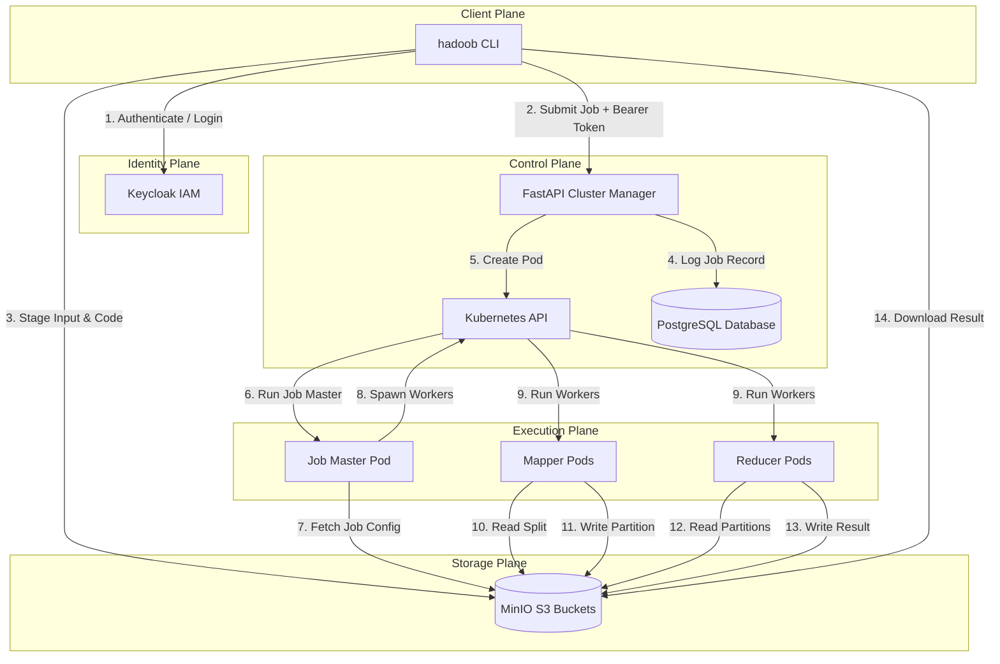

<div align="center">

# Hadoobernetes
**Cloud-Native Distributed MapReduce Engine running on Kubernetes.**

[](https://www.python.org/downloads/)
[](https://kubernetes.io/)
[](https://fastapi.tiangolo.com/)
[](https://www.docker.com/)
[](https://min.io/)
[](https://www.keycloak.org/)
[](https://opensource.org/licenses/MIT)

A cloud-native, microservices-based MapReduce system designed to run on container orchestration platforms. 

[Overview](#overview) • [Features](#features) • [Architecture](#architecture) • [Repository Structure](#repository-structure) • [Getting Started](#getting-started) • [Usage Guide](#usage-guide) • [Benchmarking](#benchmarking) • [License](#license)

</div>

---

## Overview

Hadoobernetes implements a cloud-native, containerized Map-Reduce computational engine. The system operates on a FastAPI-based **Cluster Manager** API gateway, which coordinates job configurations, acts as a bridge to the **Kubernetes API** (spawning Job Master coordinator pods dynamically), and performs authentication via a **Keycloak** identity provider. Input datasets and mapper/reducer execution scripts are staged in **MinIO S3** buckets, which are read and processed in parallel by dynamically scaled Mapper and Reducer worker pods.

---

## Features

- **Dynamic Orchestration:** Automatically spawns Job Master coordinator pods and parallel Mapper/Reducer worker pods on Kubernetes.
- **S3 Storage Staging:** Directly interfaces with MinIO buckets to load dataset splits and user-submitted Python execution code.
- **Identity & Access Management:** Integrated Keycloak OAuth2/OIDC token verification blocks unauthorized access to job endpoints.
- **Developer CLI Client:** A command-line companion (`hadoob`) to authenticate users, submit jobs, monitor execution, and download results.
- **High-Speed Sorting:** Workers utilize high-speed SQLite B-Tree sorting/indexing internally to optimize the Shuffle phase.
- **Telemetry & Metrics:** Pre-configured with Prometheus client metrics (`/metrics`) and structured JSON logging.

---

## Architecture



---

## Repository Structure

```text
.
├── cli/                 # hadoob CLI client code and installation package
├── cluster_manager/     # FastAPI API gateway & Kubernetes client controller
├── job_master/          # Coordinator pod code orchestrating MapReduce jobs
├── worker/              # Worker pod code executing Mapper/Reducer tasks
├── examples/            # Example Map-Reduce jobs and validation input files
│   ├── wordcount.py     # Example: Word count Mapper/Reducer
│   ├── vowelcount.py    # Example: Vowel count Mapper/Reducer
│   ├── input1.txt       # Example input text block
│   └── input2.txt       # Example input text block
├── deployment/          # Kubernetes YAML specs, ingress controllers & tests
├── init_scripts/        # Shell scripts for minikube cluster initialization
├── docs/                # Project reports, benchmark results & PDF (git-ignored)
├── benchmark.py         # Comprehensive local MapReduce & API benchmark suite
├── dataset.txt          # Default local validation text corpus (10.6 MB)
├── TODO.md              # Project status and implementation todo list
└── README.md            # Project documentation and setup guide
```

---

## Getting Started

### Prerequisites

Ensure you have the following installed on your machine:
- **Docker Desktop** (configured with the WSL2 backend)
- **WSL2** (Windows Subsystem for Linux)
- **Minikube** (installed inside WSL)

### Initialization

Wipe any existing cluster and run the initialization script from the repository root:

```bash
minikube delete
bash init_scripts/minikube-init.sh
kubectl apply -f ./deployment/k8s_resources/ -R
```

Open your network ingress tunnel in a separate terminal tab to route controller traffic:

```bash
sudo kubectl --kubeconfig ~/.kube/config port-forward --namespace=ingress-nginx service/ingress-nginx-controller 80:80 --address 0.0.0.0
```

Add the following local mapping line to your system `hosts` file:

```text
127.0.0.1 api.minikube.local kc.minikube.local minio.minikube.local minio-console.minikube.local
```

### Direct Service Consoles

You can access the administrative consoles on the following links:
- **Keycloak Console:** http://kc.minikube.local *(Credentials: admin / admin)*
- **MinIO Console:** http://minio-console.minikube.local *(Credentials: minioadmin / minioadmin)*

---

## Usage Guide

### 1. CLI Installation

Activate your virtual environment, navigate to the `cli/` directory, install the client in editable mode, and export target service routes:

```bash
cd cli
pip install -e .
export CLUSTER_MANAGER_URL="http://api.minikube.local"
export KEYCLOAK_URL="http://kc.minikube.local"
export MINIO_URL="minio.minikube.local:80"
```

### 2. Login

Authenticate with Keycloak to obtain a Bearer token:

```bash
hadoob login --username testuser --password test
```

### 3. File Uploads

Upload your input data manually if needed (the submission command also handles this automatically):

```bash
hadoob upload ./examples/input1.txt remote_folder/input1.txt
```

### 4. Submit a Job

Submit the Map-Reduce job by specifying the desired worker splits, input path, and execution code:

```bash
hadoob submit --mappers 2 --reducers 1 --input-file ./examples/input1.txt --code ./examples/wordcount.py
```

Upon successful validation, the gateway will return a unique **Job ID**.

### 5. Tracking & Aborting

Monitor the real-time status or terminate an active job:

```bash
hadoob status <job_id>
hadoob abort <job_id>
```

### 6. Downloading Outputs

Once the job status registers as `completed`, pull the results file back locally:

```bash
hadoob download <remote_path> ./local_output.txt
```

---

## Benchmarking

A comprehensive, local-loop benchmarking suite is included in `benchmark.py` to trace API concurrency throughput and Map-Reduce processing efficiency across varying scales:

```bash
python benchmark.py
```

### Benchmark Setup Parameters

| Parameter | Configurations | Goal |
|---|---|---|
| **FastAPI Concurrency** | Concurrency levels: $C \in \{1, 5, 10, 20, 50\}$ | Measures pure validation, serialization and routing RPS |
| **Map-Reduce Scales** | File sizes: 10 MB, 100 MB, 1 GB, 5 GB, 10 GB | Measures multi-process scaling profiles |
| **Worker Layouts** | 1 Mapper / Reducer vs. 4 Mappers / Reducers | Evaluates parallel speedups and multi-core efficiency |

*Benchmark validation results, tables, and analysis plots are automatically updated and compiled into [docs/report.pdf](file:///C:/Users/PC/Documents/GitHub/Hadoobernetes/docs/report.pdf).*

---

## License

This project is licensed under the MIT License. See the [LICENSE](LICENSE) file for more details.

---

## Authors

| [<br /><sub><b>Asterinos Karalis</b></sub>](https://github.com/Asterinos1) | [<br /><sub><b>Konstantinos Ktistakis</b></sub>](https://github.com/Ktistos) | [<br /><sub><b>iribiriee</b></sub>](https://github.com/iribiriee) |
| :---: | :---: | :---: |

Developed as part of the coursework at the Technical University of Crete.
